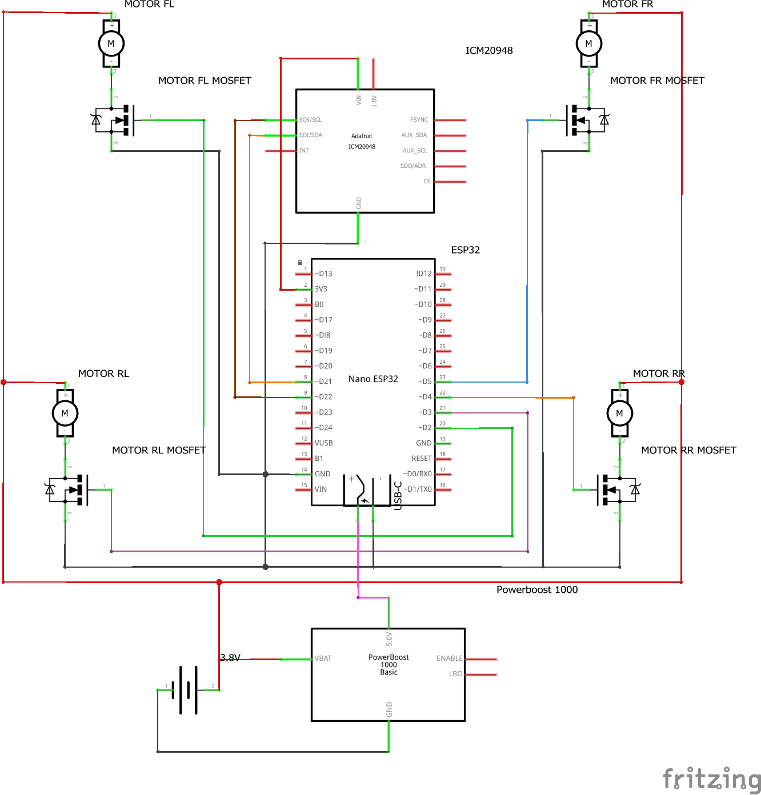

## Twiggle Drone Project
An from-scratch quadcopter built using Arduino, and capable of stable flight controlled via a WiFi connection. 

---

## Features
- Built with **Arduino Nano ESP32**
- 4x Brushless motors with PWM control
- ICM20948 for attitude sensing
- Custom PID stabilization program
- Manual flight via a GUI computer program (UDP over WiFi)

## Components
| Component                        | Description                      | Quantity | Link |
|----------------------------------|----------------------------------|----------|------|
| Arduino Nano ESP32              | Main microcontroller             | 1        | [Link](https://www.digikey.com/en/products/detail/arduino/ABX00092/21219771) |
| Adafruit ICM20948               | Gyroscope + Accelerometer        | 1        | [Link](https://www.digikey.com/en/products/detail/adafruit-industries-llc/4554/17039173) |
| Adafruit Powerboost 1000        | 3.7V → 5V power converter         | 1        | [Link](https://www.digikey.com/en/products/detail/adafruit-industries-llc/2030/5011076) |
| Adafruit USB C Breakout         | Provide power to Arduino USB C port | 1     | [Link](https://www.digikey.com/en/products/detail/adafruit-industries-llc/5978/24639123) |
| N-Channel MOSFET                | Used for PWM motor control       | 4        | [Link](https://www.digikey.com/en/products/detail/infineon-technologies/IRLZ44NPBF/811808) |
| 8520 Coreless Brushed Motors    | Drone motors/rotors              | 4        | [Link](https://www.amazon.com/dp/B076M7G24G?ref=ppx_yo2ov_dt_b_fed_asin_title) |
| GNB 3.8V 520mAh LiPo Battery (80C) | Battery                        | 1        | [Link](https://www.amazon.com/dp/B07QC17GLT?ref=ppx_yo2ov_dt_b_fed_asin_title) |
| Drone Body                      | 3D printed body                   | 1        | [link](about:blank) |

## Project Structure
twiggle-drone/ 
├── src/ 
│   ├── main.cpp 
│   └── // arduino files (to be uploaded to arduino) 
├── controller/ 
│   ├── main.cpp 
│   └── // controller files (to be run on local machine) 

## Getting Started
1. **Construct the drone**
    - The drone is activated when it receives battery power, and will wait for controller input via UDP over wifi
2. **Run the controller program**
    - build the controller program found in /controller/
    - this program should be run on a computer with the ability to connect to WiFi networks
    - connect to the drone's WiFi network before running the program
    - run the program, and the drones motors should begin at an idle state. The drone is ready to fly
### Schematic:

## Building the Firmware
1. Install [Arduino IDE](https://www.arduino.cc/en/software) or use PlatformIO
2. Install support for **Arduino Nano ESP32**
3. Clone this repo
4. Open `src/main.cpp` in the IDE and upload to the board

## Building the Controller (PC-side)
1. Requires C++17, SDL3
2. Run the build script
